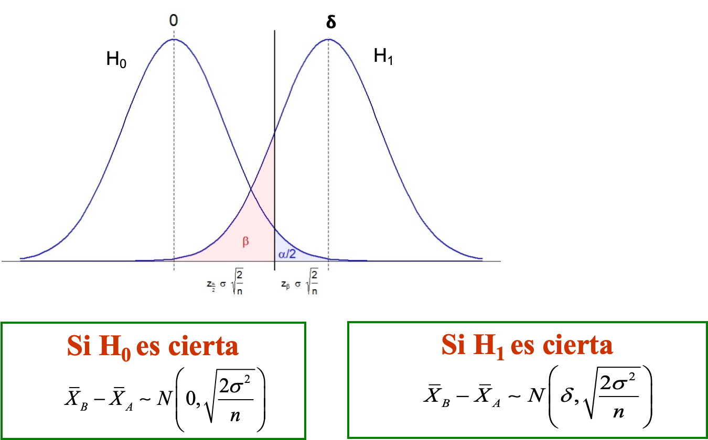

# Tamaño de muestra para contraste de hipótesis

## Muestras pareadas o independientes

Muestras **independientes**, las observaciones de una de las muestras no condicionan de ninguna forma las observaciones de la otra muestra. &#x20;

**Ejemplo**: Una muestra del Hospital A y otra del Hospital B, Una muestra del tratamiento A y otra del tratamiento B.

Muestras **pareadas**, cada dato de una muestra está relacionado con otro dato de la segunda muestra.

**Ejemplo**: Los mismos individuos antes y después de un tratamiento

## Comparar dos medias con dos muestras independientes

En un contraste de hipótesis para la igualdad de medias:

$$
H_0 : \mu_0 = \mu_1 \\
H_1 : \mu_0 \neq \mu_1
$$

El tamaño muestral se calcula con la siguiente fórmula:

$$
\
n = \frac{(Z_{\alpha/2} + Z_{\beta})^2 \cdot (2\sigma^2)}{\Delta^2}
\
$$

#### Por tanto, se necesitan cuatro cosas:&#x20;

1. **Nivel de confianza (α):** Es el nivel de significancia estadística. Usualmente α=0.05 (95% de confianza), que corresponde a $$Z_{\alpha/2} = 1.96$$.
2. **Potencia o Poder estadístico (1−β):** La probabilidad de detectar una diferencia si realmente existe. Usualmente se fija en 80%  ($$\beta = 0.2, Z_\beta = 0.84$$) o 90% ( $$\beta = 0.1, Z_\beta = 1.28$$).

<figure><figcaption></figcaption></figure>

<figure><figcaption></figcaption></figure>

* Es la probabilidad de que un estudio con un determinado tamaño muestral detecte diferencias significativas.&#x20;
* Si es alto, aumentamos la probabilidad de detectar esas diferencias
* Cuando no rechazamos $$H_0$$ siendo $$H_0$$ falsa, cometemos error de tipo II, es decir, no tenemos suficente potencia, solución: Aumentar el tamaño muestral.

<figure><figcaption></figcaption></figure>

La distancia entre los dos centros de ambas distribuciones es:

<figure><figcaption></figcaption></figure>

3. **Desviación estándar (σ):** Es la variabilidad dentro de las dos poblaciones. Puede estimarse con datos previos, un estudio piloto, y/o suponer que ambas muestras tienen la misma variabilidad.  Usaremos la misma idea que para la estimación de la media.
4. **Diferencia mínima (Δ):** Es el efecto que queremos detectar entre las dos medias. Define el cambio clínicamente relevante.  La selección de Δ depende del contexto del estudio y puede basarse en:
   1. **Criterios clínicos o prácticos:**
      * ¿Qué tamaño de efecto es lo suficientemente importante como para justificar un cambio en la práctica clínica o la implementación de un tratamiento?
      * Ejemplo: En un estudio sobre reducción de presión arterial, una disminución de Δ=5 mmHg podría considerarse relevante si tiene un impacto significativo en la salud cardiovascular.
   2. **Estudios previos:**
      * Revisa la literatura científica para identificar diferencias observadas en estudios similares.
      * Ejemplo: si estudios previos han detectado una mejora promedio de 10 puntos en una escala de dolor, puedes considerar ese valor como una posible Δ.
   3. **Opinión de expertos:**
      * Consultar a clínicos, investigadores, o profesionales en el área para determinar qué magnitud de cambio es clínicamente relevante.
      * Ejemplo: En un ensayo sobre un nuevo medicamento, los médicos pueden acordar que un cambio de al menos Δ=1 punto en una escala de calidad de vida es relevante.
   4. **Factores económicos o logísticos:**
      * En algunos casos, Δ también se define considerando el costo-beneficio de detectar un efecto o la viabilidad de implementar cambios.
5. **Relación número de pacientes entre los 2 grupos**

Se necesitará más tamaño muestral cuanto:

* menor sea $$\alpha$$
* mayor sea la potencia&#x20;
* menor sea la diferencia clínicamente relevante
* mayor sea la desviación típica

### <mark style="color:orange;">Ejemplo</mark>

**Objetivo**

Evaluar la efectividad de un analgésico A, en comparación con un analgésico B, tras seis meses de tratamiento

**Información**

La muestra del estudio debe permitir detectar una diferencia mínima de 1 punto, con un nivel de significación de 5% y una potencia estadística del 80%, en un contraste bilateral con muestras independientes. Por estudios anteriores se asume una desviación estándar común de 2,1 puntos y se tendrá el mismo número de pacientes en ambos grupos.

La variable principal X: Efectividad del analgésico medida en una escala de dolor del 0 al 10

$$
H_0 : \mu_A = \mu_B \\
H_1 : \mu_A \neq \mu_B
$$

donde:

$$\mu_A$$ es la media de la escala de dolor reportada tras seis meses con el fármaco A

$$\mu_B$$ es la media de la escala de dolor reportada tras seis meses con el fármaco B&#x20;

<figure><figcaption></figcaption></figure>

<figure><figcaption></figcaption></figure>

## Comparar dos medias con dos muestras pareadas

La fórmula para el cálculo del tamaño muestras cuando las muestras son pareadas es el siguiente:

$$
n = \frac{(Z_{\alpha/2} + Z_{\beta})^2 \cdot \sigma_d^2}{\Delta^2}
$$

La única diferencia es que hay que considerar en este caso la Desvia**ción estándar de las diferencias entre las mediciones pareadas.** Esta medida tiene en cuenta la **correlación** entre las muestras pareada&#x73;**:**

$$
\sigma_d = \sigma \cdot \sqrt{2 \cdot (1 - r)}
$$

La correlación (𝑟) dentro de los pares mide la relación entre las mediciones en dos condiciones (antes y después de una intervención, o entre dos miembros de un par). Para estimarla, necesitas datos de ambas mediciones en una muestra piloto o en un conjunto de datos similar al que planeas analizar.

### <mark style="color:orange;">Ejemplo</mark>

**Objetivo**

Evaluar si un nuevo medicamento reduce los niveles de glucosa en sangre de los diabéticos.

**Información**

Para ellos se mide la glucosa en sangre antes y después del tratamiento. Para implementar este medicamento se require observer una disminución de la glucosa en sangre de 10ml. Se sabe que la dispersion observada en los niveles de glucosa en los diabéticos es de 60ml y además que la correlación entre ambas observaciones es de 0.5. Estima el tamaño muestral para evaluar este medicamento si el nivel de confianza es del 5% y la potencia del 80%.

La variable principal X: Medición de glucosa en sangre

$$
H_0 : \mu_A = \mu_B \\
H_1 : \mu_A \neq \mu_B
$$

donde:

$$\mu_A$$ es la media de glucosa en sangra antes del tratamiento

$$\mu_B$$ es la media de glucosa en sangra después del tratamiento

<figure><figcaption></figcaption></figure>

## Comparar dos proporciones con dos muestras independientes&#x20;

En este caso vamos a tener que la variable principal es una variable cualitativa y por lo tanto compararemos proporciones. Aquí las muestras son independientes.&#x20;

En un contraste de hipótesis para la igualdad de medias:

$$
H_0 : P_1 = P_2 \\
H_1 : P_1 \neq P_2
$$

### <mark style="color:orange;">Ejemplo</mark>

**Objetivo**

Valorar los efectos del tratamiento con 40 mg de basiliximab, sobre la incidencia de los episodios de rechazo agudo en los primeros 6 meses después de un trasplante, en comparación con placebo.

**Información**

La muestra se va a calcular bajo la suposición de que la proporción de pacientes que experimentarán al menos un episodio de rechazo agudo durante los primeros 6 meses después del trasplante, debería ser del 35% en el grupo basiliximab y del 50% en el grupo placebo. Se considera un nivel de significación de 5% y la potencia requerida fue del 80%.

La variable principal X: Rechazo o no del órgano trasplantado

$$
H_0 : P_1 = P_2 \\
H_1 : P_1 \neq P_2
$$

donde:

$$P_1$$ es la proporción de rechazos con el tratamiento basiliximab

$$P_2$$ es la proporción de rechazos con el placebo

<figure><figcaption></figcaption></figure>

## Comparar dos proporciones con dos muestras pareadas

La diferencia es que las muestras en este caso son pareadas

### <mark style="color:orange;">Ejemplo</mark>

**Objetivo**

Evaluar la eficacia de un fármaco en el tratamiento de la Presión intraocular (PIO) >19 mmHg, en un estudio en el que a los pacientes se le mide su tensión intraocular antes y después de administrarle el fármaco

**Información**

La muestra se va a calcular suponiendo que la proporción de pacientes con PIO>19 mmHg antes de administrarles el fármaco será el 30% y la de pacientes con PIO>19 mmHg después de administrarles el fármaco será el 12%. El nivel de significación se tomó igual al 5% y una potencia estadística del 80 %, en un contraste bilateral con muestras pareadas.

La variable principal X: Presencia de PIO > 19mmHg

$$
H_0 : P_1 = P_2 \\
H_1 : P_1 \neq P_2
$$

donde:

$$P_1$$ es la proporción de pacientes con PIO > 19mmHg antes de administrar el fármaco

$$P_2$$ es la proporción de pacientes con PIO > 19mmHg después de administrar el fármaco

<figure><figcaption></figcaption></figure>

## Elección alpha/beta

Elegir un nivel de significación (α) de 0.05 y una potencia (1−β) de 0.8 es una práctica estándar en estudios estadísticos por varias razones:

#### Nivel de significación (α=0.05)

α es la probabilidad de cometer un error de tipo I, es decir, rechazar la hipótesis nula (H0​) cuando en realidad es verdadera.

1. **Convención estadística**: En muchos campos (como biomedicina), un valor de α=0.05 se considera un equilibrio razonable entre el riesgo de cometer un error de tipo I y la necesidad de detectar diferencias reales.
2. **Interpretación práctica**: Un α=0.05 estamos diciendo que aceptamos un 5% de riesgo de rechazar incorrectamente la hipótesis nula cuando es verdadera.
3. **Flexibilidad**: Aunque es un estándar, en situaciones críticas (como en estudios de seguridad de medicamentos), puede ser necesario un αmás estricto (como 0.01 o 0.001).

#### Potencia (1−β=0.8)

La potencia es la probabilidad de detectar una diferencia real cuando existe, es decir, evitar un error de tipo II (no rechazar H0​ cuando es falsa).

1. **Estándar mínimo aceptable**: Una potencia de 0.8 (80%) significa que se acepta un 20% de riesgo de no detectar una diferencia real, lo cual es considerado razonable en muchos estudios.
2. **Equilibrio entre recursos y certeza**: Aumentar la potencia (por ejemplo, a 0.9 o más) requiere un mayor tamaño de muestra, lo que incrementa el costo y la duración del estudio. Un 80% es un compromiso aceptable entre recursos y confiabilidad.
3. **Dependencia del tamaño del efecto**: Si se espera un efecto pequeño, podría ser necesario una potencia mayor para garantizar que el estudio tenga capacidad suficiente para detectarlo.

#### Juntos: α=0.05y 1−β=0.8

1. **Balance riesgo-beneficio**: Este par de valores equilibra el riesgo de errores de tipo I y tipo II, garantizando que el estudio sea lo suficientemente sensible sin comprometer demasiado la especificidad.
2. **Reproducibilidad**: Usar α=0.05 y 1−β=0.8 facilita comparar resultados con otros estudios que suelen seguir el mismo estándar.
3. **Confianza en los resultados**: Proporciona una base confiable para tomar decisiones estadísticas en base a evidencia sólida.
